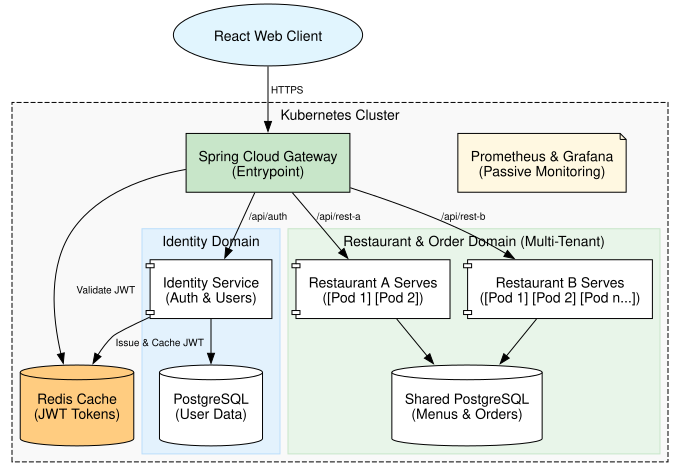
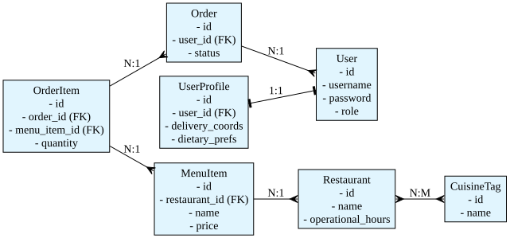

# OmniEats — food-order-system

A multi-vendor food marketplace built as Spring Boot microservices behind a Spring Cloud
Gateway, with a React frontend, an AI search service backed by a local LLM (Ollama via
Spring AI), Redis caching, and Prometheus/Grafana monitoring.

The stack runs two ways: **Docker Compose** (simplest) or **Kubernetes / Minikube**.

## Services

| Component | Port | Notes |
|---|---|---|
| Frontend (React + nginx) | 3000 | the web UI |
| API Gateway (Spring Cloud Gateway) | 8080 | single entry point, JWT validation, rate limiting |
| Identity Service | 8081 | auth, users, JWT signing |
| Restaurant Service | 8082 | restaurants, menus, orders (3 replicas under K8s) |
| AI Aggregator Service | 8083 | NL search → Ollama → suggestions (keyword fallback) |
| PostgreSQL / Redis / Ollama | 5432 / 6379 / 11434 | backing stores |
| Prometheus / Grafana | 9090 / 3001 | metrics + dashboards (Grafana: `admin` / `admin`) |

Seeded logins: **`admin@omnieats.com` / `admin123`** (USER+ADMIN) and **`user@omnieats.com` / `user123`** (USER).

---

## Run with Docker Compose

Prerequisites: Docker + Docker Compose. Run everything from the `docker/` directory.

```bash
cd docker
docker compose up -d --build      # --build so images reflect the current code
docker compose ps                 # wait until services are healthy
```

Open the app at **<http://localhost:3000>** and log in with a seeded account.

PostgreSQL provisions `identity_db` and `restaurant_db` on first boot via `init-db.sql`.

**Optional — enable the real LLM** (AI Search falls back to keyword matching without it):
```bash
docker compose exec ollama ollama pull llama3.1:8b
```

**Teardown:**
```bash
docker compose stop          # pause, keep data
docker compose down -v       # destroy + wipe volumes
```

More detail (logs, monitoring, dashboards): [`docker/README.md`](docker/README.md).

---

## Run with Kubernetes (Minikube)

Prerequisites: Docker, `minikube`, `kubectl`. Manifests live in [`k8s/`](k8s/) and deploy the
full stack into the `omnieats` namespace — centralized config (ConfigMap + Secret), service
discovery via Kubernetes DNS, and `restaurant-service` load-balanced across 3 replicas.

```bash
# 1. Build the app images (Compose builds docker-<service>:latest)
cd docker && docker compose build && cd ..

# 2. Start the cluster and load the images
minikube start --memory=8192 --cpus=4
for img in gateway-service identity-service restaurant-service ai-aggregator-service; do
  minikube image load "docker-$img:latest"
done
minikube image load docker-frontend:latest

# 3. Deploy
kubectl apply -f k8s/
kubectl get pods -n omnieats -w        # wait until Ready (restaurant-service shows 3/3)

# 4. Access (the frontend calls the API at localhost:8080, so forward the gateway there)
kubectl port-forward -n omnieats svc/gateway-service 8080:8080 &
kubectl port-forward -n omnieats svc/frontend        3000:80   &
```

Open **<http://localhost:3000>**. Full runbook (Grafana dashboards, LLM model, Kind
alternative, verification, teardown): [`k8s/README.md`](k8s/README.md).

---

## Documentation

- [Requirements](docs/requirements.md) · [Functional Requirements](docs/functional-requirements.md)

### System Architecture


### Entity-Relationship Diagram

